# UML Class Diagram - Banking System

**Purpose:** Visual representation of all 22 classes, relationships, and dependencies in the Banking System.

**Note:** For a detailed written explanation of how each class connects, see **`CLASS_CONNECTIONS_GUIDE.md`** which explains:
- 4 types of connections (Inheritance, Composition, Aggregation, Association)
- Class-by-class details with code examples
- Visual connection maps and data flow scenarios
- InputValidator architecture and clean layer separation

---

## 1. CLASS HIERARCHY OVERVIEW

### Account Inheritance Tree
```
           ┌─────────────────────┐
           │   <<abstract>>      │
           │      Account        │
           │─────────────────────│
           │ - accountNo: String │
           │ - balance: double   │
           │ - owner: Customer   │
           │ - txHistory:        │
           │   LinkedList<Tx>    │
           ├─────────────────────┤
           │ + withdraw(): bool◇ │
           │ + getDetails(): Str◇│
           └──────────┬──────────┘
                      │
        ┌─────────────┴─────────────┐
        │                           │
  ┌─────────────────┐      ┌─────────────────┐
  │ SavingsAccount  │      │ CheckingAccount │
  ├─────────────────┤      ├─────────────────┤
  │ - interestRate  │      │ - overdraftLimit│
  ├─────────────────┤      ├─────────────────┤
  │ + applyInterest │      │ + withdraw():.. │
  │ + withdraw():.. │      │ + getDetails()  │
  │ + getDetails()  │      └─────────────────┘
  └─────────────────┘
```

### User Inheritance Tree
```
           ┌──────────────────────┐
           │   <<abstract>>       │
           │       User           │
           │──────────────────────│
           │ - username: String◆  │
           │ - password: String◆  │
           │ - userRole:          │
           │   UserRole◆          │
           │ - passChgRequired:   │
           │   boolean            │
           ├──────────────────────┤
           │ + authenticate()     │
           │ + hasPermission()    │
           │ + getPermissions()◇  │
           └──────────┬───────────┘
                      │
        ┌─────────────┴──────────────┐
        │                            │
    ┌──────────┐            ┌──────────────────┐
    │  Admin   │            │  UserAccount     │
    ├──────────┤            ├──────────────────┤
    │(concrete)│            │-linkedCustomerId │
    ├──────────┤            │ : String◆        │
    │getPerms()│            ├──────────────────┤
    │ returns  │            │getPermissions()  │
    │ 21       │            │getLinkedCustId() │
    │ permissions           │                  │
    └──────────┘            └──────────────────┘
```

---

## 2. DOMAIN MODELS

### Customer & Profile (1:1 Relationship)
```
┌──────────────────────┐         ┌──────────────────────────┐
│     Customer         │         │  CustomerProfile         │
├──────────────────────┤         ├──────────────────────────┤
│ - customerId: String │    ┌───►│ - profileId: String      │
│ - name: String       │    │    │ - address: String        │
│ - accounts:          │    │    │ - phone: String          │
│   LinkedList<Acct>   │    │    │ - email: String          │
│ - profile:           │────┘    │ - customer: Customer     │
│   CustomerProfile    │         │                          │
├──────────────────────┤         ├──────────────────────────┤
│ + addAccount()       │         │ + setters()              │
│ + removeAccount()    │         │ + validation             │
│ + getAccounts()      │         └──────────────────────────┘
└──────────────────────┘
        △
        │ 1-to-Many
        │
    ┌───┴────────────────────────────┐
    │                                │
┌───────────────────────┐    Customer 1 : Many Accounts
│      Account          │
├───────────────────────┤
│ - accountNo: String   │
│ - balance: double     │
│ - owner: Customer     │
│ - txHistory:          │
│   LinkedList<Tx>      │
├───────────────────────┤
│ + deposit()           │
│ + withdraw()          │
└───────────────────────┘
        △
        │ Inheritance
        │
    ┌───┴────┬─────────┐
    │        │         │
  (Savings)(Checking)  │
```

### Transaction Model
```
┌──────────────────────────────┐
│      Transaction             │
├──────────────────────────────┤
│ - txId: String               │
│ - fromAccountNo: String      │
│ - toAccountNo: String        │
│ - type: TransactionType      │
│ - amount: double             │
│ - timestamp: LocalDateTime   │
│ - status: String             │
├──────────────────────────────┤
│ + getters/setters()          │
│ + validation()               │
└──────────────────────────────┘
        △
        │
    ┌───┴────────────────────────┐
    │                            │
TransactionType (Enum):
  - DEPOSIT
  - WITHDRAW
  - TRANSFER
```

---

## 3. SYSTEM COMPONENTS (COMPOSITION)

### BankingSystem - Main Orchestrator
```
┌─────────────────────────────────────────┐
│         BankingSystem                   │
├─────────────────────────────────────────┤
│ - customers: LinkedList<Customer>       │
│ - accountList: LinkedList<Account>      │
│ - validator: InputValidator             │
│ - customerMgr: CustomerManager          │
│ - accountMgr: AccountManager            │
│ - txProcessor: TransactionProcessor     │
│ - authManager: AuthenticationManager    │
│ - currentUser: User                     │
├─────────────────────────────────────────┤
│ + startApplication()                    │
│ + login(): User                         │
│ + logout()                              │
│ + canAccessAccount(): boolean           │
│ + hasPermission(): boolean              │
│ + logAction()                           │
│ + CRUD delegates                        │
└──────────┬──────────────────────────────┘
           │
    ┌──────┴──────┬──────────┬────────────┬──────────────┐
    │             │          │            │              │
    ▼             ▼          ▼            ▼              ▼
┌─────────┐ ┌───────────┐ ┌────────┐ ┌──────────┐ ┌───────┐
│Customer │ │ Account   │ │Transact│ │InputVal  │ │Auth   │
│Manager  │ │Manager    │ │Proc    │ │idator    │ │Manager│
└─────────┘ └───────────┘ └────────┘ └──────────┘ └───────┘
```

---

## 4. AUTHENTICATION SYSTEM

### User Registry & Access Control
```
┌──────────────────────────────┐
│ AuthenticationManager         │
├──────────────────────────────┤
│ - userRegistry:              │
│   LinkedList<User>           │
│ - auditTrail:                │
│   LinkedList<AuditLog>       │
│ - currentUser: User          │
│ - loginAttempts: int         │
├──────────────────────────────┤
│ + login(): User              │
│ + logout()                   │
│ + registerUser()             │
│ + changePassword(): User     │
│ + logAction()                │
└──────────┬───────────────────┘
           │
    ┌──────┴────────────────┐
    │                       │
    ▼                       ▼
┌────────────┐      ┌──────────────┐
│  User[]    │      │ AuditLog[]   │
│  •Admin    │      │ [Immutable]  │
│  •Customer │      │ - timestamp  │
└────────────┘      │ - username   │
                    │ - action     │
                    │ - details    │
                    └──────────────┘
```

### Permission System
```
User.getPermissions() ──────┐
                            │
              ┌─────────────┘
              │
              ▼
┌──────────────────────────────────────┐
│     Admin Permissions (21)           │
├──────────────────────────────────────┤
│ • CREATE/DELETE CUSTOMER             │
│ • VIEW/MANAGE ACCOUNTS               │
│ • CREATE/UPDATE PROFILES             │
│ • APPLY INTEREST                     │
│ • VIEW AUDIT TRAIL                   │
│ • SORT ACCOUNTS                      │
│ • EXIT/LOGOUT                        │
└──────────────────────────────────────┘

┌──────────────────────────────────────┐
│   Customer Permissions (8)           │
├──────────────────────────────────────┤
│ • DEPOSIT / WITHDRAW / TRANSFER      │
│ • VIEW OWN ACCOUNTS & HISTORY        │
│ • CHANGE PASSWORD                    │
│ • LOGOUT / EXIT                      │
└──────────────────────────────────────┘
```

---

## 5. INPUT VALIDATION SYSTEM

### Validation Patterns (Centralized)
```
┌────────────────────────────────────┐
│   ValidationPatterns               │
│   (Static Constants)               │
├────────────────────────────────────┤
│ • CUSTOMER_ID_PATTERN = "C\\d{3}"  │
│ • ACCOUNT_NO_PATTERN = "ACC\\d{3}" │
│ • PROFILE_ID_PATTERN = "P\\d{3}"   │
│ • EMAIL_PATTERN = regex            │
│ • TRANSACTION_STATUS_PATTERN       │
│ • Error messages                   │
├────────────────────────────────────┤
│ + matchesPattern()                 │
│ + isNonEmpty()                     │
│ + isValidPhoneNumber()             │
└────────────────────────────────────┘
         △
         │ Used by
         │
┌────────────────────────────────────┐
│   InputValidator                   │
├────────────────────────────────────┤
│ • getCancellableInput()            │
│ • getValidatedInput()              │
│ • getValidatedAmount()             │
│ • confirmAction()                  │
│ • getValidatedAccountWithControl() │
└────────────────────────────────────┘
```

---

## 6. DATA STRUCTURES USED

### LinkedList Usage Map
```
BankingSystem
├── LinkedList<Customer> customers
├── LinkedList<Account> accountList
│
Customer
├── LinkedList<Account> accounts
│
Account
├── LinkedList<Transaction> transactionHistory
│
AuthenticationManager
├── LinkedList<User> userRegistry
├── LinkedList<AuditLog> auditTrail
│
User
├── LinkedList<String> getPermissions()
│
Manager Classes (CustomerManager, AccountManager, etc.)
└── All reference LinkedList collections
```

### Other Data Structures
```
Enums (Type Safety):
├── TransactionType (DEPOSIT, WITHDRAW, TRANSFER)
├── UserRole (ADMIN, CUSTOMER)
└── MenuAction (LOGOUT, EXIT_APPLICATION)

Insertion Sort Algorithm:
├── Sort by Customer Name (ascending)
└── Sort by Account Balance (descending)

Stack<Transaction> (in TransactionProcessor):
└── For LIFO display of transaction history
```

---

## 7. COMPLETE DEPENDENCY GRAPH

```
Main
 └─ BankingSystem (Facade Pattern)
     ├─ InputValidator
     │   ├─ ValidationPatterns
     │   └─ AccountUtils
     │
     ├─ CustomerManager (Composition)
     │   ├─ Customer CRUD
     │   ├─ Profile Management
     │   ├─ Auto-ID Generation
     │   └─ Onboarding Workflow
     │
     ├─ AccountManager (Composition)
     │   ├─ Account CRUD
     │   ├─ Sorting (Insertion Sort algorithm)
     │   ├─ Polymorphic Operations
     │   └─ Interest Management
     │
     ├─ TransactionProcessor (Composition)
     │   ├─ Deposit/Withdraw/Transfer
     │   ├─ Stack-based History
     │   ├─ Access Control
     │   └─ Transaction Validation
     │
     └─ AuthenticationManager (Composition)
        ├─ User Registry (LinkedList)
        ├─ Login/Logout
        ├─ Permission Checking
        ├─ Audit Trail (LinkedList)
        └─ Password Management

Domain Models (Models Package):
├── Account (Abstract)
│   ├── SavingsAccount (Concrete)
│   └── CheckingAccount (Concrete)
├── Customer
├── CustomerProfile
├── Transaction
└── TransactionType (Enum)

Auth Classes (Auth Package):
├── User (Abstract)
│   ├── Admin (Concrete)
│   └── UserAccount (Concrete)
├── UserRole (Enum)
└── AuditLog
```

---

## 8. MULTIPLICITY & RELATIONSHIPS

| Relationship | Cardinality | Type | Details |
|---|---|---|---|
| Customer → Account | 1 : * | Composition | One customer has many accounts |
| Customer → Profile | 1 : 1 | Composition | Bidirectional relationship |
| Account → Transaction | 1 : * | Composition | Chronological history |
| BankingSystem → Managers | 1 : 1 | Composition | Each manager uniquely owned |
| Admin → Permissions | 1 : 1 | Association | 21 permissions per admin |
| Customer User → Permissions | 1 : 1 | Association | 8 permissions per customer |
| Account → Customer (owner) | * : 1 | Association | Many accounts owned by customer |

---

## 9. KEY OOP PRINCIPLES DEMONSTRATED

### Encapsulation
- All fields private with controlled getters/setters
- Validation in setters (never expose unvalidated data)
- Clear separation of public interface from implementation
- Final fields for immutable objects (User, AuditLog)

### Inheritance
- Account (abstract) → SavingsAccount, CheckingAccount
- User (abstract) → Admin, UserAccount
- Enables polymorphic behavior (withdraw(), getDetails(), getPermissions())

### Abstraction
- Abstract Account class forces subclass implementation
- Abstract User class defines permission interface
- Hides implementation details behind clear contracts

### Polymorphism
**Runtime (Method Overriding):**
- `Account.withdraw()` - implemented differently by each account type
- `Account.getDetails()` - polymorphic display
- `User.getPermissions()` - different permissions per role

**Compile-time (Method Overloading):**
- `InputValidator` methods with different parameter combinations
- Multiple constructor variations

---

## 10. DESIGN PATTERNS

| Pattern | Location | Purpose |
|---|---|---|
| **Facade** | BankingSystem | Simplified interface to complex subsystems |
| **Composition** | BankingSystem uses Managers | Flexible, loose coupling |
| **Strategy** | Insertion Sort methods | Multiple sorting strategies (by name, by balance) |
| **Factory** | Auto-generation methods | Create IDs/passwords dynamically |
| **Template Method** | Abstract Account class | Define skeleton, let subclasses implement |
| **Dependency Injection** | Scanner passed to constructors | Loose coupling, testability |
| **Repository** | Manager classes | Data access abstraction |
| **Immutable Object** | User password change | Security through immutability |

---

## 11. SECURITY ARCHITECTURE

```
┌─────────────────────────────────────┐
│   Login (3-attempt limit)           │
└────────┬────────────────────────────┘
         │
         ▼
┌─────────────────────────────────────┐
│   Permission-Based Menu Access      │
│   (shouldShowMenuOption checks)     │
└────────┬────────────────────────────┘
         │
    ┌────┴────┐
    │         │
    ▼         ▼
┌────────┐ ┌──────────┐
│ Admin  │ │ Customer │
│ Menu   │ │  Menu    │
└────────┘ └──────────┘
    │         │
    ▼         ▼
┌─────────────────────────────────────┐
│   Access Control (Audit Logged)     │
│   canAccessAccount() check for      │
│   all customer transactions         │
└─────────────────────────────────────┘
```

---

## 12. COMPILATION & PACKAGE STRUCTURE

**All classes compile to: `bin/com/banking/`**

```
bin/
 └─ com/
     └─ banking/
         ├─ Main.class
         ├─ BankingSystem.class
         ├─ MenuAction.class
         │
         ├─ models/
         │   ├─ Account.class
         │   ├─ SavingsAccount.class
         │   ├─ CheckingAccount.class
         │   ├─ Customer.class
         │   ├─ CustomerProfile.class
         │   ├─ Transaction.class
         │   └─ TransactionType.class
         │
         ├─ auth/
         │   ├─ User.class
         │   ├─ Admin.class
         │   ├─ UserAccount.class
         │   ├─ UserRole.class
         │   ├─ AuthenticationManager.class
         │   └─ AuditLog.class
         │
         ├─ managers/
         │   ├─ CustomerManager.class
         │   ├─ AccountManager.class
         │   └─ TransactionProcessor.class
         │
         └─ utilities/
             ├─ InputValidator.class
             ├─ ValidationPatterns.class
             └─ AccountUtils.class
```

---

## 13. SUMMARY

This Banking System demonstrates:

✅ **Strong OOP**: Clear inheritance, polymorphism, encapsulation
✅ **Real-World Design**: Bank domain knowledge applied throughout
✅ **Data Structures**: LinkedList (7 uses), Stack, Enum, Insertion Sort algorithm
✅ **Security**: RBAC, audit logging, access control
✅ **Composition**: Proper use of composition over inheritance
✅ **Validation**: Centralized patterns with comprehensive checks
✅ **Clean Architecture**: Single responsibility, clear separation of concerns

**Total Classes: 22**
**Total Lines: ~4,500**
**Documentation: Comprehensive JavaDoc throughout**

---

## 14. PLANTUML DIAGRAM (For Visual Rendering)

### How to Use PlantUML:
1. **Online:** Paste code at https://www.plantuml.com/plantuml/uml/
2. **VS Code:** Install PlantUML extension, open file with @startuml
3. **IntelliJ:** Built-in PlantUML support

```plantuml
@startuml Banking_System
!theme plain
scale 1.5

' Define color scheme
!define ABSTRACT_COLOR #FFE6E6
!define CONCRETE_COLOR #E6F2FF
!define MODEL_COLOR #E6FFE6
!define MANAGER_COLOR #FFF4E6
!define UTILITY_COLOR #F0E6FF
!define ENUM_COLOR #FFE6F0

' ============================================
' ABSTRACT CLASSES
' ============================================

abstract class Account {
    - accountNo: String
    - balance: double
    - owner: Customer
    - transactionHistory: LinkedList<Transaction>
    --
    + deposit(double): boolean
    + withdraw(double): boolean {abstract}
    + getDetails(): String {abstract}
    + addTransaction(Transaction): void
    + getBalance(): double
    + getOwner(): Customer
}

abstract class User {
    - username: String {final}
    - password: String {final}
    - userRole: UserRole {final}
    - passwordChangeRequired: boolean
    --
    + authenticate(String): boolean
    + hasPermission(String): boolean
    + getPermissions(): LinkedList<String> {abstract}
}

' ============================================
' CONCRETE ACCOUNT CLASSES
' ============================================

class SavingsAccount extends Account {
    - interestRate: double
    --
    + withdraw(double): boolean
    + getDetails(): String
    + applyInterest(): void
    + setInterestRate(double): void
}

class CheckingAccount extends Account {
    - overdraftLimit: double
    --
    + withdraw(double): boolean
    + getDetails(): String
    + setOverdraftLimit(double): void
    + getOverdraftLimit(): double
}

' ============================================
' CONCRETE USER CLASSES
' ============================================

class Admin extends User {
    --
    + getPermissions(): LinkedList<String>
    + note "Returns 21 admin permissions"
}

class UserAccount extends User {
    - linkedCustomerId: String {final}
    --
    + getPermissions(): LinkedList<String>
    + getLinkedCustomerId(): String
    + note "Returns 8 customer permissions"
}

' ============================================
' DOMAIN MODELS
' ============================================

class Customer {
    - customerId: String
    - name: String
    - accounts: LinkedList<Account>
    - profile: CustomerProfile
    --
    + addAccount(Account): void
    + removeAccount(String): boolean
    + getAccounts(): LinkedList<Account>
    + getProfile(): CustomerProfile
    + setProfile(CustomerProfile): void
}

class CustomerProfile {
    - profileId: String
    - address: String
    - phone: String
    - email: String
    - customer: Customer
    --
    + validate(): boolean
    + setters/getters with validation
}

class Transaction {
    - txId: String
    - fromAccountNo: String
    - toAccountNo: String
    - type: TransactionType
    - amount: double
    - timestamp: LocalDateTime
    - status: String
    --
    + getters(): String/double/TransactionType
    + validate(): boolean
}

enum TransactionType {
    DEPOSIT
    WITHDRAW
    TRANSFER
}

enum UserRole {
    ADMIN
    CUSTOMER
}

' ============================================
' AUTHENTICATION & AUDIT
' ============================================

class AuthenticationManager {
    - userRegistry: LinkedList<User>
    - auditTrail: LinkedList<AuditLog>
    - currentUser: User
    - loginAttempts: int
    --
    + login(String, String): User
    + logout(): void
    + registerUser(User): void
    + changePassword(String, String, String): User
    + logAction(String, String, String): void
    + displayAuditTrail(): void
}

class AuditLog {
    - timestamp: LocalDateTime {final}
    - username: String {final}
    - userRole: UserRole {final}
    - action: String {final}
    - details: String {final}
    --
    + getters(): String/LocalDateTime/UserRole
}

' ============================================
' MANAGERS
' ============================================

class CustomerManager {
    - customers: LinkedList<Customer>
    - validator: InputValidator
    --
    + handleCreateCustomer(): void
    + handleViewCustomerDetails(): void
    + handleViewAllCustomers(): void
    + handleDeleteCustomer(): void
    + handleCreateCustomerProfile(): void
    + handleUpdateCustomerProfile(): void
}

class AccountManager {
    - accounts: LinkedList<Account>
    - validator: InputValidator
    --
    + handleCreateAccount(): void
    + handleViewAccountDetails(): void
    + handleViewAllAccounts(): void
    + handleDeleteAccount(): void
    + handleUpdateOverdraftLimit(): void
    + handleApplyInterest(): void
    + handleSortByName(): void
    + handleSortByBalance(): void
}

class TransactionProcessor {
    - accounts: LinkedList<Account>
    --
    + deposit(String, double): boolean
    + withdraw(String, double): boolean
    + transfer(String, String, double): boolean
    + handleDeposit(): void
    + handleWithdraw(): void
    + handleTransfer(): void
    + handleViewTransactionHistory(): void
}

' ============================================
' UTILITIES
' ============================================

class InputValidator {
    --
    + getCancellableInput(String): String
    + getIntInput(String): int
    + getDoubleInput(String): double
    + confirmAction(String): boolean
    + safeLogAction(String, String): void
    + validateInput(String, String): boolean
}

class ValidationPatterns {
    {static} CUSTOMER_ID_PATTERN: String = "^C\\d{3}$"
    {static} ACCOUNT_NO_PATTERN: String = "^ACC\\d{3}$"
    {static} PROFILE_ID_PATTERN: String = "^P\\d{3}$"
    {static} EMAIL_PATTERN: String
    {static} TRANSACTION_STATUS_PATTERN: String
    --
    {static} matchesPattern(String, String): boolean
    {static} isNonEmpty(String): boolean
    {static} isValidPhoneNumber(String): boolean
}

class AccountUtils {
    --
    {static} findAccount(LinkedList<Account>, String): Account
}

enum MenuAction {
    LOGOUT
    EXIT_APPLICATION
}

' ============================================
' MAIN ORCHESTRATOR
' ============================================

class BankingSystem {
    - customers: LinkedList<Customer>
    - accountList: LinkedList<Account>
    - validator: InputValidator
    - customerMgr: CustomerManager
    - accountMgr: AccountManager
    - txProcessor: TransactionProcessor
    - authManager: AuthenticationManager
    - currentUser: User
    --
    + startApplication(): void
    + login(): User
    + logout(): void
    + canAccessAccount(String, String): boolean
    + hasPermission(String): boolean
    + runConsoleMenu(): void
    + [CRUD Method Delegates]
}

class Main {
    --
    {static} main(String[]): void
    {static} initializeDemoData(): void
}

' ============================================
' RELATIONSHIPS - COMPOSITION
' ============================================

BankingSystem *-- "1" InputValidator
BankingSystem *-- "1" CustomerManager
BankingSystem *-- "1" AccountManager
BankingSystem *-- "1" TransactionProcessor
BankingSystem *-- "1" AuthenticationManager
BankingSystem o-- "1..*" Customer
BankingSystem o-- "1..*" Account

' ============================================
' RELATIONSHIPS - ASSOCIATION
' ============================================

Customer "1" -- "*" Account : owns >
Customer "1" -- "1" CustomerProfile : has >
Account "*" -- "1" Customer : owner
Account "1" -- "*" Transaction : contains >

AuthenticationManager "1" -- "*" User : manages >
AuthenticationManager "1" -- "*" AuditLog : records >

User "1" -- "*" String : permissions >
Admin --|> User
UserAccount --|> User

' ============================================
' RELATIONSHIPS - OTHER
' ============================================

Account <|-- SavingsAccount
Account <|-- CheckingAccount

Transaction --> "1" TransactionType
User --> "1" UserRole

CustomerManager --> InputValidator
AccountManager --> InputValidator
TransactionProcessor --> InputValidator

InputValidator --> ValidationPatterns
AccountUtils --> Account

Main --> BankingSystem

@enduml
```



---

## 15. ENHANCED ASCII UML DIAGRAM

### Complete System Architecture
```
════════════════════════════════════════════════════════════════════════════════
                            BANKING SYSTEM - COMPLETE UML
════════════════════════════════════════════════════════════════════════════════

                                    ┌──────────┐
                                    │   Main   │
                                    └─────┬────┘
                                          │ creates
                                          ▼
                        ┌─────────────────────────────────┐
                        │      BankingSystem              │
                        │      (Facade Pattern)           │
                        ├─────────────────────────────────┤
                        │ COMPOSITION:                    │
                        │ - InputValidator                │
                        │ - CustomerManager               │
                        │ - AccountManager                │
                        │ - TransactionProcessor          │
                        │ - AuthenticationManager         │
                        ├─────────────────────────────────┤
                        │ AGGREGATION:                    │
                        │ - LinkedList<Customer>          │
                        │ - LinkedList<Account>           │
                        │ - User currentUser              │
                        └─────────────────────────────────┘
                                      │
                ┌─────────────────────┼─────────────────────┐
                │                     │                     │
                ▼                     ▼                     ▼
    ┌──────────────────┐  ┌──────────────────┐  ┌──────────────────┐
    │ CustomerManager  │  │ AccountManager   │  │TransactionProc   │
    ├──────────────────┤  ├──────────────────┤  ├──────────────────┤
    │ CRUD: Customer   │  │ CRUD: Account    │  │ Txn Operations   │
    │ CRUD: Profile    │  │ Sorting          │  │ History Display  │
    │ Auto-generation  │  │ Interest Mgmt    │  │ Access Control   │
    └────────┬─────────┘  └────────┬─────────┘  └────────┬─────────┘
             │                     │                     │
             ▼                     ▼                     ▼
    ┌──────────────────┐  ┌──────────────────┐  ┌──────────────────┐
    │    Customer      │  │ Account (Abs)    │  │  Transaction     │
    ├──────────────────┤  ├──────────────────┤  ├──────────────────┤
    │ - customerId     │  │ - accountNo      │  │ - txId           │
    │ - name           │  │ - balance        │  │ - fromAcctNo     │
    │ - accounts (LL)  │  │ - owner          │  │ - toAcctNo       │
    │ - profile (1:1)  │  │ - txHistory (LL) │  │ - type (Enum)    │
    └────────┬─────────┘  ├──────────────────┤  │ - amount         │
             │            │ + withdraw()◆    │  │ - timestamp      │
             │            │ + getDetails()◆  │  │ - status         │
             │            └────────┬─────────┘  └──────────────────┘
             │                     │
             │            ┌────────┴─────────┐
             │            │                  │
             │            ▼                  ▼
             │    ┌─────────────────┐  ┌──────────────────┐
             │    │ SavingsAccount  │  │ CheckingAccount  │
             │    ├─────────────────┤  ├──────────────────┤
             │    │ - interestRate  │  │ - overdraftLimit │
             │    │ + applyInterest │  │ + withdraw() {   │
             │    │ + withdraw()    │  │   allows if bal+ │
             │    └─────────────────┘  │   overdraft ≥amt }│
             │                         └──────────────────┘
             │
     1 : *   │
    ┌────────┴─────────┐
    │ CustomerProfile  │
    ├──────────────────┤
    │ - profileId      │
    │ - address        │
    │ - phone          │
    │ - email          │
    │ - customer (ref) │
    └──────────────────┘


════════════════════════════════════════════════════════════════════════════════
                          AUTHENTICATION SYSTEM
════════════════════════════════════════════════════════════════════════════════

                    ┌──────────────────────────────┐
                    │ AuthenticationManager         │
                    ├──────────────────────────────┤
                    │ - userRegistry (LL<User>)    │
                    │ - auditTrail (LL<AuditLog>)  │
                    │ - currentUser: User          │
                    ├──────────────────────────────┤
                    │ + login(): User              │
                    │ + logout(): void             │
                    │ + changePassword(): User     │
                    │ + logAction(): void          │
                    └────────────┬─────────────────┘
                                 │
                    ┌────────────┴───────────────┐
                    │                           │
                    ▼                           ▼
        ┌─────────────────────┐      ┌──────────────────────┐
        │  User (Abstract)    │      │    AuditLog          │
        ├─────────────────────┤      │  [IMMUTABLE]         │
        │ - username {final}  │      ├──────────────────────┤
        │ - password {final}  │      │ - timestamp {final}  │
        │ - userRole {final}  │      │ - username {final}   │
        │ - passChgReq        │      │ - userRole {final}   │
        ├─────────────────────┤      │ - action {final}     │
        │ + authenticate()    │      │ - details {final}    │
        │ + hasPermission()   │      └──────────────────────┘
        │ + getPermissions()◆ │
        └────────────┬────────┘
                     │
            ┌────────┴────────┐
            │                 │
            ▼                 ▼
    ┌──────────────┐  ┌───────────────────────┐
    │   Admin      │  │  UserAccount          │
    ├──────────────┤  ├───────────────────────┤
    │ (concrete)   │  │ - linkedCustomerId    │
    │ + getPerms() │  │   {final}             │
    │   (21 perms) │  │ + getPermissions()    │
    └──────────────┘  │   (8 perms)           │
                      └───────────────────────┘


════════════════════════════════════════════════════════════════════════════════
                          VALIDATION & UTILITIES
════════════════════════════════════════════════════════════════════════════════

    ┌────────────────────────────────────────────────────────────┐
    │          InputValidator (Central Validation)               │
    ├────────────────────────────────────────────────────────────┤
    │ + getCancellableInput(String): String                      │
    │ + getIntInput(String): int                                 │
    │ + getDoubleInput(String): double                           │
    │ + confirmAction(String): boolean                           │
    │ + safeLogAction(String, String): void                      │
    │ + validateInput(String, String): boolean                   │
    └─────────────────────┬──────────────────────────────────────┘
                          │ uses
                          ▼
        ┌──────────────────────────────────────────┐
        │    ValidationPatterns (Static)           │
        ├──────────────────────────────────────────┤
        │ CUSTOMER_ID_PATTERN = "^C\\d{3}$"        │
        │ ACCOUNT_NO_PATTERN = "^ACC\\d{3}$"       │
        │ PROFILE_ID_PATTERN = "^P\\d{3}$"         │
        │ EMAIL_PATTERN = [standard regex]         │
        │ PHONE_ERROR, ID_ERROR, etc.              │
        ├──────────────────────────────────────────┤
        │ + matchesPattern(): boolean              │
        │ + isNonEmpty(): boolean                  │
        │ + isValidPhoneNumber(): boolean          │
        └──────────────────────────────────────────┘

                        │ uses
                        ▼
        ┌──────────────────────────────┐
        │  AccountUtils (Static)       │
        ├──────────────────────────────┤
        │ + findAccount(): Account     │
        └──────────────────────────────┘


════════════════════════════════════════════════════════════════════════════════
                            ENUMS & CONSTANTS
════════════════════════════════════════════════════════════════════════════════

    ┌──────────────────┐  ┌──────────────────┐  ┌──────────────────┐
    │ TransactionType  │  │   UserRole       │  │   MenuAction     │
    ├──────────────────┤  ├──────────────────┤  ├──────────────────┤
    │ • DEPOSIT        │  │ • ADMIN          │  │ • LOGOUT         │
    │ • WITHDRAW       │  │ • CUSTOMER       │  │ • EXIT_APP       │
    │ • TRANSFER       │  └──────────────────┘  └──────────────────┘
    └──────────────────┘


════════════════════════════════════════════════════════════════════════════════
                        COMPLETE DEPENDENCY GRAPH
════════════════════════════════════════════════════════════════════════════════

                                Main.java
                                   │
                                   ├─ creates
                                   ▼
                           BankingSystem
                           (Facade Pattern)
                                   │
                    ┌──────┬────────┼────────┬──────────┐
                    │      │        │        │          │
                    ▼      ▼        ▼        ▼          ▼
                   InputValidator  CustomerManager
                    │
                    ├─ ValidationPatterns
                    └─ AccountUtils

                    CustomerManager
                    ├─ CRUD: Customer
                    ├─ CRUD: Profile
                    └─ Auto-generation system

                    AccountManager
                    ├─ CRUD: Account
                    ├─ Insertion Sort (by name, balance)
                    ├─ Interest Management
                    └─ Sorting display (before/after)

                    TransactionProcessor
                    ├─ Deposit / Withdraw / Transfer
                    ├─ Stack-based history display
                    └─ Access Control enforcement

                    AuthenticationManager
                    ├─ User Registry (LinkedList<User>)
                    ├─ Audit Trail (LinkedList<AuditLog>)
                    ├─ Login/Logout
                    ├─ Password Change
                    └─ Permission Checking


════════════════════════════════════════════════════════════════════════════════
                          DATA STRUCTURES MAP
════════════════════════════════════════════════════════════════════════════════

    LinkedList<Customer>          →  BankingSystem
    LinkedList<Account>           →  BankingSystem, TransactionProcessor
    LinkedList<Account>           →  Customer.accounts
    LinkedList<Transaction>       →  Account.transactionHistory
    LinkedList<User>              →  AuthenticationManager
    LinkedList<AuditLog>          →  AuthenticationManager
    LinkedList<String>            →  User.getPermissions()
    Stack<Transaction>            →  TransactionProcessor (history display)
    Enum: TransactionType         →  Transaction.type
    Enum: UserRole                →  User.userRole
    Enum: MenuAction              →  Application flow control


════════════════════════════════════════════════════════════════════════════════
                          MULTIPLICITY SUMMARY
════════════════════════════════════════════════════════════════════════════════

    Customer         1 : * Accounts        (One customer has many accounts)
    Customer         1 : 1 Profile         (One customer has one profile)
    Account          1 : * Transactions    (One account has many transactions)
    User             1 : 1 AuthManager     (One user managed by auth)
    Admin            1 : 21 Permissions    (21 admin permissions)
    UserAccount      1 : 8  Permissions    (8 customer permissions)
    AuditLog        *  : 1  AuthManager    (Many logs in one manager)

════════════════════════════════════════════════════════════════════════════════
```

---

---

## 16. COMPLETE UNIFIED UML DIAGRAM (All Classes & Connections)

```
═══════════════════════════════════════════════════════════════════════════════════════════════════════════════════════════
                                    BANKING SYSTEM - COMPLETE UNIFIED UML DIAGRAM
═══════════════════════════════════════════════════════════════════════════════════════════════════════════════════════════


                                                              ┌──────────┐
                                                              │   Main   │
                                                              └─────┬────┘
                                                                    │ creates
                                                                    ▼
                                          ┌─────────────────────────────────────────┐
                                          │        BankingSystem (Facade)           │
                                          ├─────────────────────────────────────────┤
                                          │ - customers: LL<Customer>               │
                                          │ - accountList: LL<Account>              │
                                          │ - validator: InputValidator             │
                                          │ - customerMgr: CustomerManager          │
                                          │ - accountMgr: AccountManager            │
                                          │ - txProcessor: TransactionProcessor     │
                                          │ - authManager: AuthenticationManager    │
                                          │ - currentUser: User                     │
                                          └───────────────────┬─────────────────────┘
                                                              │
                      ┌───────────────────┬──────────────────┼──────────────────┬───────────────────┐
                      │                   │                  │                  │                   │
                      ▼                   ▼                  ▼                  ▼                   ▼
        ┌─────────────────────┐  ┌─────────────────────┐ ┌──────────────────┐ ┌──────────────────┐ ┌──────────────────┐
        │ InputValidator      │  │ CustomerManager    │ │ AccountManager   │ │TransactionProc   │ │AuthenticationMgr │
        ├─────────────────────┤  ├─────────────────────┤ ├──────────────────┤ ├──────────────────┤ ├──────────────────┤
        │ + getCancellInput() │  │ + handleCreate...() │ │ + handleCreate() │ │ + deposit()      │ │ - userRegistry   │
        │ + getIntInput()     │  │ + handleView...()   │ │ + handleView()   │ │ + withdraw()     │ │   (LL<User>)     │
        │ + getDoubleInput()  │  │ + handleDelete...() │ │ + handleDelete() │ │ + transfer()     │ │ - auditTrail     │
        │ + confirmAction()   │  │ + handleCreate      │ │ + handleSort...()│ │ + handleHistory()│ │   (LL<AuditLog>) │
        │ + safeLogAction()   │  │   Profile()         │ │ + handleApply    │ │ - currentUser    │ ├──────────────────┤
        └────────────┬────────┘  │ + handleUpdate      │ │   Interest()     │ └────────┬─────────┘ │ + login()        │
                     │           │   Profile()         │ └────────┬─────────┘          │            │ + logout()       │
                     │           └────────┬────────────┘          │                    │            │ + changePassword()│
                     │                    │                       │                    │            │ + logAction()    │
                     ▼                    │                       │                    │            └────────┬─────────┘
        ┌──────────────────────────┐     │                       │                    │                     │
        │ValidationPatterns (Static)│     │                       │                    │            ┌────────┴────────┐
        ├──────────────────────────┤     │                       │                    │            │                 │
        │ CUSTOMER_ID_PATTERN      │     │                       │                    │            ▼                 ▼
        │ ACCOUNT_NO_PATTERN       │     ▼                       ▼                    ▼    ┌──────────────────┐ ┌──────────────────────┐
        │ PROFILE_ID_PATTERN       │  ┌──────────────┐    ┌──────────────┐    ┌──────────────────┐ │ User (Abstract)  │ │    AuditLog          │
        │ EMAIL_PATTERN            │  │   Customer   │    │ Account      │    │  Transaction     │ │[IMMUTABLE]       │ │ [IMMUTABLE]          │
        │ + matchesPattern()       │  ├──────────────┤    │(Abstract)    │    ├──────────────────┤ ├──────────────────┤ ├──────────────────────┤
        │ + isNonEmpty()           │  │ - customerId │    ├──────────────┤    │ - txId: String   │ │ - username{final}│ │ - timestamp {final}  │
        │ + isValidPhoneNumber()   │  │ - name       │    │ - accountNo  │    │ - fromAccountNo  │ │ - password{final}│ │ - username {final}   │
        └────────────┬─────────────┘  │ - accounts   │    │ - balance    │    │ - toAccountNo    │ │ - userRole{final}│ │ - userRole {final}   │
                     │                │   (LL<Acct>) │    │ - owner      │    │ - type: TxnType  │ │ - passChgReq     │ │ - action {final}     │
                     │                │ - profile    │    │ - txHistory  │    │ - amount: double │ ├──────────────────┤ │ - details {final}    │
                     │                │   (1:1)      │    │   (LL<Tx>)   │    │ - timestamp      │ │ + authenticate() │ └──────────────────────┘
                     │                ├──────────────┤    ├──────────────┤    │ - status         │ │ + hasPermission()│
                     │                │ + addAccount │    │ + deposit()  │    ├──────────────────┤ │ + getPermissions()◆
        ┌────────────┴─────────────┐  │ + removeAcct │    │ + withdraw() │    │ + getters()      │ └────────┬──────────┘
        │  AccountUtils (Static)   │  └──────┬───────┘    │  ◆          │    │ + validate()     │          │
        ├──────────────────────────┤         │            │ + getDetails│    └──────────────────┘          │
        │ + findAccount()          │         │            │  ◆          │                                   │
        └──────────────────────────┘         │            └──────┬──────┘                       ┌──────────┴────────────┐
                                             │                   │                              │                       │
                                             │         ┌─────────┴──────────┐                  ▼                       ▼
                                             │         │                    │        ┌──────────────────┐      ┌──────────────────┐
                                             │         ▼                    ▼        │   Admin          │      │  UserAccount     │
                                             │    ┌──────────────────┐  ┌──────────────────┐ │ (concrete)   │      │ - linkedCustId   │
                                             │    │ SavingsAccount   │  │CheckingAccount   │ ├──────────────┤      │   {final}        │
                                             │    ├──────────────────┤  ├──────────────────┤ │ + getPerms() │      ├──────────────────┤
                                             │    │ - interestRate   │  │ - overdraftLimit │ │   (21 perms) │      │ + getPermissions()
                                             │    ├──────────────────┤  ├──────────────────┤ └──────────────┘      │   (8 perms)      │
                                             │    │ + withdraw()     │  │ + withdraw()     │                        └──────────────────┘
                                             │    │ + getDetails()   │  │ + getDetails()   │
                                             │    │ + applyInterest()│  │ + setOverdraft() │
                                             │    └──────────────────┘  └──────────────────┘
                                             │
                                             │
                                    ┌────────┴──────────┐
                                    │                   │
                                    ▼                   ▼
                            ┌──────────────────┐  ┌─────────────────────┐
                            │CustomerProfile   │  │ TransactionType     │
                            │ [1:1 with Cust]  │  │ (Enum)              │
                            ├──────────────────┤  ├─────────────────────┤
                            │ - profileId      │  │ • DEPOSIT           │
                            │ - address        │  │ • WITHDRAW          │
                            │ - phone          │  │ • TRANSFER          │
                            │ - email          │  └─────────────────────┘
                            │ - customer (ref) │
                            └──────────────────┘

════════════════════════════════════════════════════════════════════════════════════════════════════════════════════════════
                                            COMPLETE RELATIONSHIPS & ARROWS
════════════════════════════════════════════════════════════════════════════════════════════════════════════════════════════

COMPOSITION (Filled Diamond ◆ = Strong Ownership):
  BankingSystem ◆─── InputValidator
  BankingSystem ◆─── CustomerManager
  BankingSystem ◆─── AccountManager
  BankingSystem ◆─── TransactionProcessor
  BankingSystem ◆─── AuthenticationManager

AGGREGATION (Circle ○ = Weak Ownership):
  BankingSystem ○─── LinkedList<Customer>
  BankingSystem ○─── LinkedList<Account>
  Customer ○─── LinkedList<Account>
  Account ○─── LinkedList<Transaction>
  AuthenticationManager ○─── LinkedList<User>
  AuthenticationManager ○─── LinkedList<AuditLog>
  User ○─── LinkedList<String> (permissions)

INHERITANCE (Triangle ▲ = "extends"):
  Account ▲─── SavingsAccount
  Account ▲─── CheckingAccount
  User ▲─── Admin
  User ▲─── UserAccount

ASSOCIATION (Arrow → = "uses" or "depends on"):
  BankingSystem ──→ Customer (stores 1..*)
  BankingSystem ──→ Account (stores 1..*)
  BankingSystem ──→ User (manages 1..*)

  Customer ──→ Account (owns 1..*)
  Customer ──→ CustomerProfile (has 1..1)
  Account ──→ Transaction (contains 1..*)
  Account ──→ Customer (owner 1..1)

  Transaction ──→ TransactionType (uses enum)
  User ──→ UserRole (uses enum)
  User ──→ LinkedList<String> (permissions)

  AuthenticationManager ──→ User (manages registry)
  AuthenticationManager ──→ AuditLog (logs actions)

  CustomerManager ──→ InputValidator (delegates validation)
  AccountManager ──→ InputValidator (delegates validation)
  TransactionProcessor ──→ InputValidator (delegates validation)

  InputValidator ──→ ValidationPatterns (uses static patterns)
  InputValidator ──→ AccountUtils (uses utility methods)

  TransactionProcessor ──→ Account (finds and updates)
  TransactionProcessor ──→ Stack<Transaction> (LIFO display)

════════════════════════════════════════════════════════════════════════════════════════════════════════════════════════════
                                                  MULTIPLICITY NOTATION
════════════════════════════════════════════════════════════════════════════════════════════════════════════════════════════

BankingSystem ○──────1..* Customer          (One banking system manages many customers)
BankingSystem ○──────1..* Account           (One banking system manages many accounts)
BankingSystem ◆──────1 InputValidator       (One banking system owns one validator)
BankingSystem ◆──────1 CustomerManager      (One banking system owns one customer manager)
BankingSystem ◆──────1 AccountManager       (One banking system owns one account manager)
BankingSystem ◆──────1 TransactionProcessor (One banking system owns one txn processor)
BankingSystem ◆──────1 AuthenticationManager(One banking system owns one auth manager)
BankingSystem ──────1 User                  (One banking system has current logged-in user)

Customer ─────1──────* Account              (One customer owns many accounts)
Customer ─────1──────1 CustomerProfile      (One customer has one profile)
Account ──────1──────* Transaction          (One account has many transactions)
Account ──────* ──────1 Customer            (Many accounts owned by one customer)

AuthenticationManager ─1──────* User        (One auth manager manages many users)
AuthenticationManager ─1──────* AuditLog    (One auth manager logs many audit entries)

User ─────────1──────* String               (One user has many permissions)
Admin ┘└─ User                              (Admin IS-A User - inheritance)
UserAccount ┘└─ User                        (UserAccount IS-A User - inheritance)

SavingsAccount ┘└─ Account                  (SavingsAccount IS-A Account - inheritance)
CheckingAccount ┘└─ Account                 (CheckingAccount IS-A Account - inheritance)

════════════════════════════════════════════════════════════════════════════════════════════════════════════════════════════
                                            CLASS SUMMARY WITH ALL CONNECTIONS
════════════════════════════════════════════════════════════════════════════════════════════════════════════════════════════

┌─ ENTRY POINT ─────────────────────────────────────────────────────────────────────────────────────────────────────────┐
│  Main.java → creates BankingSystem → initializes demo data                                                            │
└────────────────────────────────────────────────────────────────────────────────────────────────────────────────────────┘

┌─ ORCHESTRATOR (FACADE PATTERN) ────────────────────────────────────────────────────────────────────────────────────────┐
│  BankingSystem:                                                                                                        │
│    ◆ Composes: InputValidator, CustomerMgr, AccountMgr, TransactionProc, AuthenticationMgr                           │
│    ○ Aggregates: LinkedList<Customer>, LinkedList<Account>, currentUser: User                                        │
│    ↔ Delegates to managers for CRUD operations                                                                        │
│    ↔ Enforces access control: canAccessAccount(customerId, accountNo)                                                 │
│    ↔ Provides menu interface to BankingSystem                                                                         │
└────────────────────────────────────────────────────────────────────────────────────────────────────────────────────────┘

┌─ MANAGERS (SERVICE LAYER) ─────────────────────────────────────────────────────────────────────────────────────────────┐
│  CustomerManager:                                                                                                      │
│    → CRUD: Create, Read, Update, Delete customers                                                                    │
│    → Create/Update customer profiles (1:1 relationship)                                                               │
│    → Auto-generate: Customer IDs, Usernames, Temporary Passwords                                                     │
│    → Delegates validation to InputValidator                                                                           │
│                                                                                                                        │
│  AccountManager:                                                                                                       │
│    → CRUD: Create, Read, Update, Delete accounts                                                                     │
│    → Handles both SavingsAccount and CheckingAccount (polymorphism)                                                   │
│    → Sorting: Insertion sort by name or balance (before/after display)                                                │
│    → Interest: Apply interest to all SavingsAccount instances                                                         │
│    → Delegates validation to InputValidator                                                                           │
│                                                                                                                        │
│  TransactionProcessor:                                                                                                │
│    → Deposit: Add money to account, create Transaction, update balance                                                │
│    → Withdraw: Remove money respecting account type rules (overdraft/no-overdraft)                                   │
│    → Transfer: Move money between accounts, validate access control                                                   │
│    → History: Use Stack (LIFO) to display most recent transactions first                                              │
│    → Enforces access control via BankingSystem.canAccessAccount()                                                     │
│    → Delegates validation to InputValidator                                                                           │
└────────────────────────────────────────────────────────────────────────────────────────────────────────────────────────┘

┌─ AUTHENTICATION & SECURITY ────────────────────────────────────────────────────────────────────────────────────────────┐
│  AuthenticationManager:                                                                                                │
│    ○ Manages: LinkedList<User> userRegistry (all system users)                                                       │
│    ○ Logs: LinkedList<AuditLog> auditTrail (immutable records)                                                       │
│    → Login: 3-attempt limit, generic error messages (security)                                                        │
│    → Register: Create new Admin or UserAccount (customer-linked)                                                      │
│    → Password Change: Old password verification, immutable object pattern                                             │
│    → Access Control: Check permissions via User.hasPermission()                                                       │
│                                                                                                                        │
│  User (Abstract):                                                                                                      │
│    - Fields (final/immutable): username, password, userRole, passwordChangeRequired                                  │
│    - Methods: authenticate(), hasPermission(), getPermissions() ◆ (abstract)                                          │
│    - Subclasses:                                                                                                      │
│      • Admin: Returns 21 permissions (all admin operations)                                                            │
│      • UserAccount: Linked to specific customer, returns 8 permissions (customer operations)                          │
│                                                                                                                        │
│  AuditLog (Immutable):                                                                                                │
│    - Records: timestamp, username, userRole, action, details (all final)                                              │
│    - Used for compliance, security auditing, debugging                                                                │
└────────────────────────────────────────────────────────────────────────────────────────────────────────────────────────┘

┌─ DOMAIN MODELS ────────────────────────────────────────────────────────────────────────────────────────────────────────┐
│  Customer:                                                                                                             │
│    ○ Has 1..* Accounts (LinkedList<Account>) - can own multiple accounts                                             │
│    → Has 1..1 CustomerProfile - one profile per customer                                                              │
│    - Auto-generated: customerId (C001, C002, ...), linked to username/password                                        │
│                                                                                                                        │
│  CustomerProfile:                                                                                                      │
│    ↔ 1:1 relationship with Customer (bidirectional)                                                                   │
│    - Info: profileId (P###), address, phone (10+ digits), email (regex)                                               │
│    - Validation: All fields validated with ValidationPatterns                                                         │
│                                                                                                                        │
│  Account (Abstract):                                                                                                   │
│    ○ Stores 1..* Transactions (LinkedList<Transaction>) - chronological history                                       │
│    - Owner: Reference to Customer who owns this account                                                               │
│    - Methods: deposit() (common), withdraw() ◆ (polymorphic), getDetails() ◆ (polymorphic)                            │
│    - Subclasses:                                                                                                      │
│      • SavingsAccount: No overdraft, supports interest accrual                                                        │
│      • CheckingAccount: Overdraft protection with configurable limit                                                 │
│                                                                                                                        │
│  Transaction:                                                                                                          │
│    - Immutable record: txId (TX###), fromAcctNo, toAcctNo, type, amount, timestamp, status                            │
│    - Type: DEPOSIT, WITHDRAW, TRANSFER (TransactionType enum)                                                         │
│    - Status: COMPLETED or FAILED                                                                                      │
└────────────────────────────────────────────────────────────────────────────────────────────────────────────────────────┘

┌─ VALIDATION & UTILITIES ───────────────────────────────────────────────────────────────────────────────────────────────┐
│  InputValidator:                                                                                                       │
│    → Centralized input/output for user interaction                                                                    │
│    → Methods: getCancellableInput(), getIntInput(), getDoubleInput(), confirmAction(), safeLogAction()               │
│    → Uses ValidationPatterns for regex validation                                                                     │
│    → Uses AccountUtils for account lookups                                                                            │
│                                                                                                                        │
│  ValidationPatterns (Static):                                                                                         │
│    - Regex patterns: CUSTOMER_ID_PATTERN (C###), ACCOUNT_NO_PATTERN (ACC###), etc.                                  │
│    - Methods: matchesPattern(), isNonEmpty(), isValidPhoneNumber()                                                    │
│    - DRY principle: All validation constants in one place                                                             │
│                                                                                                                        │
│  AccountUtils (Static):                                                                                               │
│    → findAccount(LinkedList<Account>, String accountNo): Account                                                      │
│    → O(n) linear search (acceptable for small collections)                                                            │
│    → Used by all managers for account lookup                                                                          │
└────────────────────────────────────────────────────────────────────────────────────────────────────────────────────────┘

┌─ ENUMS & CONSTANTS ────────────────────────────────────────────────────────────────────────────────────────────────────┐
│  TransactionType: DEPOSIT, WITHDRAW, TRANSFER                                                                        │
│  UserRole: ADMIN, CUSTOMER                                                                                            │
│  MenuAction: LOGOUT, EXIT_APPLICATION                                                                                 │
└────────────────────────────────────────────────────────────────────────────────────────────────────────────────────────┘

════════════════════════════════════════════════════════════════════════════════════════════════════════════════════════════
                                            DATA FLOW EXAMPLES
════════════════════════════════════════════════════════════════════════════════════════════════════════════════════════════

EXAMPLE 1: Customer Deposits Money
  1. User selects menu option "Deposit" → TransactionProcessor.handleDeposit()
  2. TransactionProcessor checks access: BankingSystem.canAccessAccount(customerId, accountNo)
  3. AccountUtils.findAccount() locates Account object
  4. Account.deposit(amount) updates balance
  5. Transaction object created and added to Account.transactionHistory
  6. Stack displays LIFO transaction history (most recent first)
  7. InputValidator.safeLogAction() creates AuditLog entry
  8. AuthenticationManager records in LinkedList<AuditLog> auditTrail

EXAMPLE 2: Admin Creates New Customer
  1. Admin selects menu → CustomerManager.handleCreateCustomer()
  2. InputValidator.getCancellableInput() gets customer name
  3. Auto-generation: customerId (C001+), username (diana_prince), tempPassword
  4. AuthenticationManager.registerUser() creates UserAccount object
  5. LinkedList<User> userRegistry updated with new user
  6. InputValidator.safeLogAction() logs the action
  7. AuditLog entry added to auditTrail

EXAMPLE 3: Customer Changes Password
  1. Customer selects option "Change Password"
  2. InputValidator prompts for old password
  3. AuthenticationManager.changePassword() verifies old password
  4. New User object created with new password (immutable pattern)
  5. LinkedList<User> userRegistry updated (removes old, adds new)
  6. Password change logged to AuditLog
  7. InputValidator.safeLogAction() confirms completion

════════════════════════════════════════════════════════════════════════════════════════════════════════════════════════════
                                            COMPLETE CONNECTION SUMMARY
════════════════════════════════════════════════════════════════════════════════════════════════════════════════════════════

Total Classes: 22
Total Relationships: 47+
Total Data Structures: LinkedList (7 uses), Stack (1 use), Enum (3 types)
Total Design Patterns: Facade, Composition, Dependency Injection, Strategy, Template Method,
                       Immutable Object, Factory, Repository, Single Responsibility

All classes properly connected through:
  • COMPOSITION for strong ownership (Managers, Validators)
  • AGGREGATION for weak ownership (Collections)
  • INHERITANCE for polymorphic behavior (Account types, User roles)
  • ASSOCIATION for dependencies (uses/depends-on relationships)

════════════════════════════════════════════════════════════════════════════════════════════════════════════════════════════
```

---

**UML Diagram Version:** 3.0
**Last Updated:** November 18, 2025
**Status:** Production Ready - Complete Unified Diagram with All Connections
